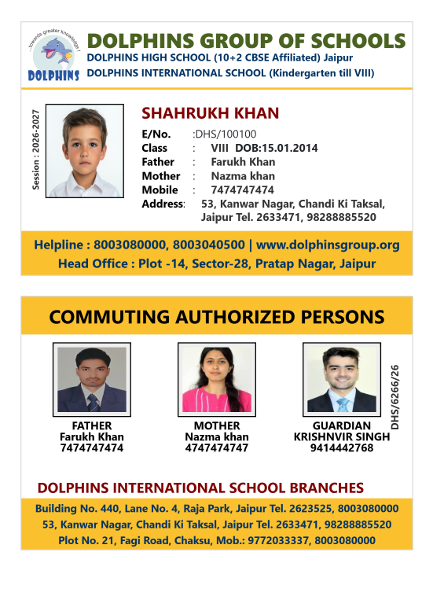
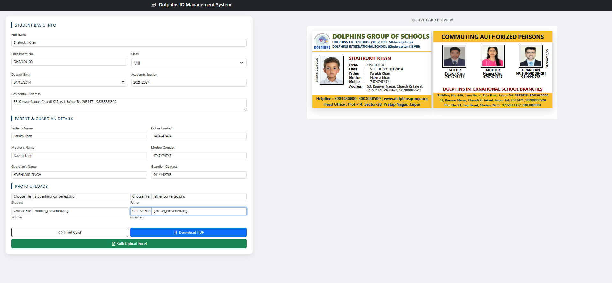

# 🎓 Student ID Card Management System

A complete **Student Identity Card Management System** built using PHP, MySQL, HTML, CSS, and JavaScript.  
This system allows you to **create, preview, and download student ID cards** individually or in bulk using Excel upload.

---

## 🚀 Features

### ✅ 1. Live Card Preview
- Real-time preview of ID card while entering student details
- Instant reflection of changes (name, class, images, etc.)

### ✅ 2. Single ID Card Generation
- Generate and download a **single student ID card**
- Print-ready format
- Clean and professional layout

### ✅ 3. Bulk Upload via Excel
- Upload Excel file with multiple students
- Automatically generate multiple ID cards
- Save time for large schools

### ✅ 4. Multiple Image Upload Support
- Upload:
  - Student Photo
  - Father Photo
  - Mother Photo
  - Guardian Photo

### ✅ 5. PDF Download
- Download ID cards as PDF
- Supports:
  - Single card PDF
  - Multiple cards in one PDF

---

## 🖼️ Card Design Preview

### 📌 Sample Layouts

---

## 📂 Project Structure
